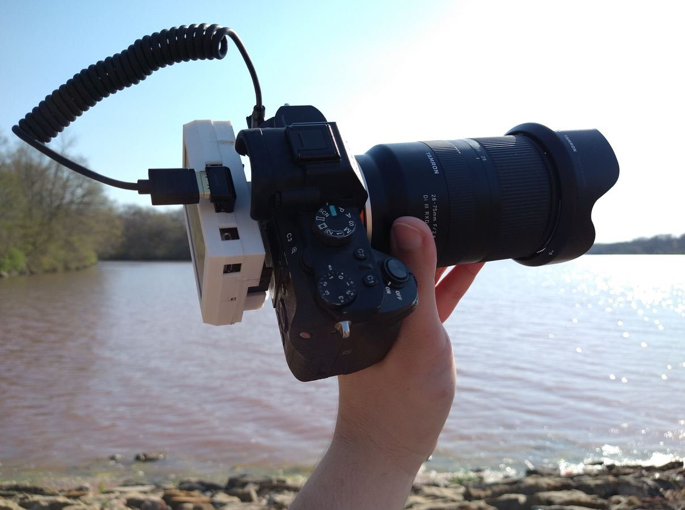
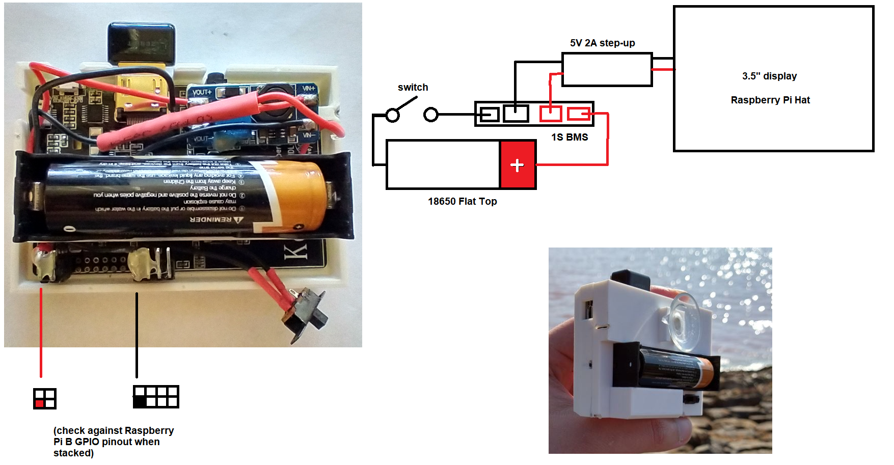

### About
This is an external display I made for my broken Sony A7 II. I broke it on accident by shorting the LCD ribbon cable so the backlight no longer works on any new LCD displays.

This is not worth doing because the display is so dim, you can barely see it on a bright sunny day.

#### Outdoors

#### Diagram

#### Note
The 3D printed body has a flaw, the screws specifically, the diameter is too small to allow a screwdriver shaft to go down into the screw holes.

I ended up gluing the two bodies together.

Also the USB was blocked on the first print but I changed the model aftwards to extend that. I didn't really inted to use the USB in so wasn't important to check it/make sure accessible. It doesn't look like updated the STL.

#### Print times
The total print time is at least 7 hrs. The "top-case" takes the longest at 4 hours.

Used white PLA, 200C nozzle, 60C bed (standard Cura settings)
